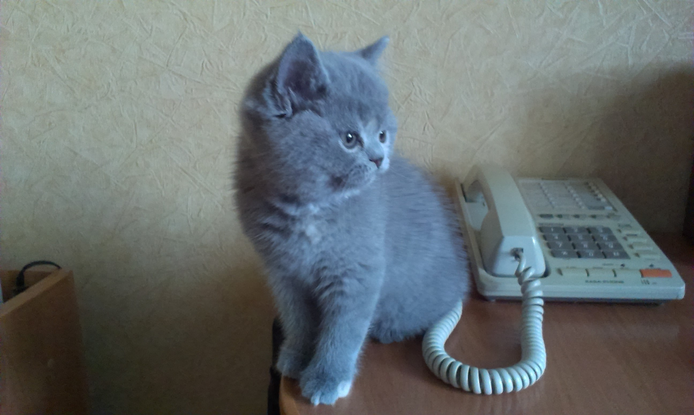

# Second example post

Another important text.
Even more **important** than the last one obviously.

## Header 2

More text here.

Even more after blank line.

> Some quote.

## Some image

Here is an image:


## Some code snippet

```go
func main() {
  panic()
}
```
