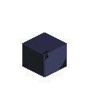
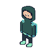
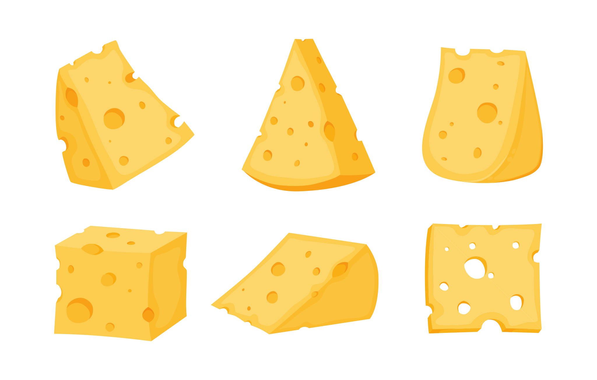

# Fifth example post

Another important text.
Even more **important** than the last one obviously.

## Header 2

More text here.

Even more after blank line.

## Quotes

Here is a quote:
> Some quote.

## Images

Here are a few images:





## Images auto-uploaded to CDN


## Code snippets

Inline code: `if err != nil { return err }`.

Code blocks:

```go
func main() {
  panic()
}
```

```tsx
const f = () => {
  return <div>Hi!</div>
}
```

## Lists

- Point one
- Point two
- Point three

## Links

- <https://misha.spris.dev>
- <https://github.com/mtratsiuk/b3>
